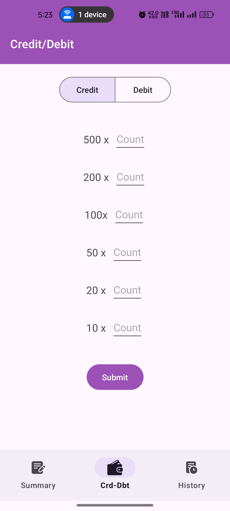
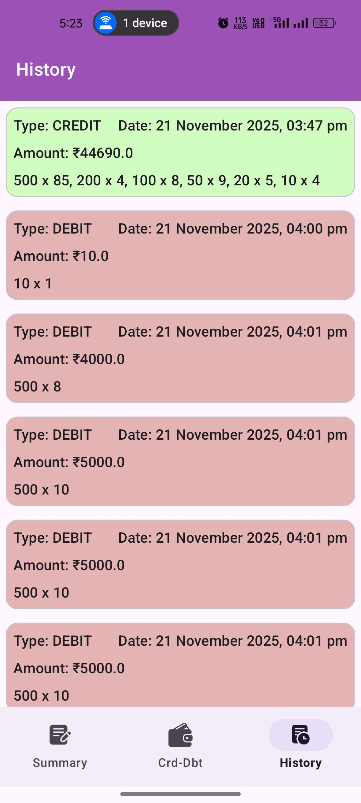
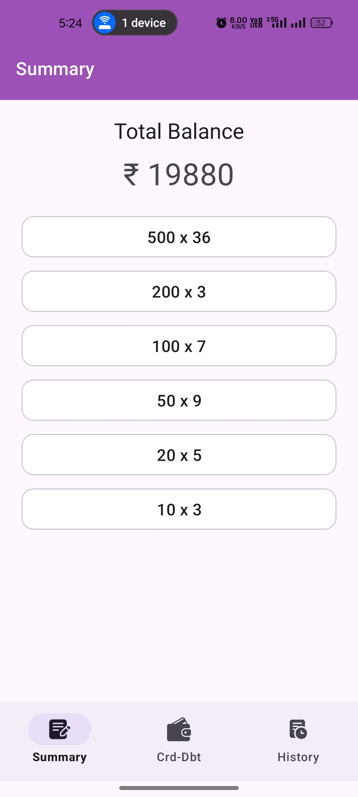
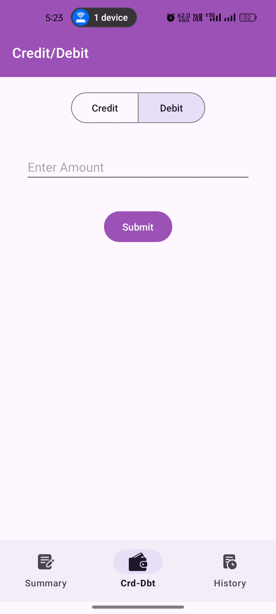

# **CashBuddy – Cash Management System**

[]()
[]()
[]()
[]()
[]()
[]()

---

## **Overview**

**CashBuddy** is an offline-first Android application that simulates a cash management machine using
actual INR denominations (₹10–₹500).
The app supports:

* Crediting cash
* Debiting cash
* Exact denomination calculations
* Full transaction history
* Real-time summary dashboard

The implementation adheres to clean MVVM architecture, uses ObjectBox for ultra-fast local storage,
and Koin for dependency injection.

The functional specification is based on the provided **Android Practical: Cash Machine Document** .

---

## **Running App Demo**


---

## **Demo Screens**

| Screen         | Image                                   |
|----------------|-----------------------------------------|
| Credit Screen  |    |
| History Screen |  |
| Summary Screen |  |
| Debit Screen   |      |

---

## **Table of Contents**

* Features
* Architecture
* Tech Stack
* Project Structure
* Database Models
* Functional Flow
* Validations
* Running the Project
* Future Enhancements
* License

---

## **Features**

### **Credit**

* Accepts amount input
* Validates input (positive, multiple of ₹10)
* Distributes amount into denominations
* Saves transaction with denomination breakdown
* Updates summary in real time

### **Debit**

* Validates sufficient balance
* Validates exact denomination availability
* Deducts correct denominations
* Stores transaction record

### **History**

* Reverse chronological list
* Shows amount, type, date, denomination distribution

### **Summary**

* Shows available count for each denomination
* Calculates subtotal and total cash

---

## **Architecture**

### **MVVM + Repository + Koin + ObjectBox**

```
┌────────────┐
│  UI Layer  │  (Fragments, Adapters)
└─────┬──────┘
      │
┌─────▼──────┐
│ ViewModels │  (Business Logic, State)
└─────┬──────┘
      │
┌─────▼──────┐
│ Repository │  (CashRepository)
└─────┬──────┘
      │
┌─────▼─────────────┐
│  ObjectBox Store  │ (Persisted Data)
└───────────────────┘
```

This structure ensures a **clean separation of concerns**, high testability, and future
maintainability.

---

## **Tech Stack**

### **Languages**

* Kotlin 2.2.21

### **Core Android**

* AndroidX Core KTX
* AppCompat
* Material Components
* Activity KTX
* Fragment KTX
* ConstraintLayout

### **Architecture & DI**

* ViewModel
* LiveData
* Koin DI (4.1.1)

### **Database**

* ObjectBox (`objectbox-android`, `objectbox-kotlin`)

### **Testing**

* JUnit 4
* Espresso

(Reference: `libs.versions.toml` )

---

## **Project Structure**

```
app/
│
├── data/
│   ├── db/
│   │   └── models/
│   │       ├── Denomination.kt
│   │       ├── TransactionHistory.kt
│   │       └── TransactionDenomination.kt
│   ├── repository/
│   │   └── CashRepository.kt
│   └── OBUtils.kt
│
├── ui/
│   ├── creditDebit/
│   │   ├── CreditDebitFragment.kt
│   │   └── CreditDebitViewModel.kt
│   ├── history/
│   │   ├── HistoryFragment.kt
│   │   ├── HistoryAdapter.kt
│   │   └── HistoryViewModel.kt
│   └── summary/
│       ├── SummaryFragment.kt
│       ├── SummaryAdapter.kt
│       └── SummaryViewModel.kt
│
├── di/
│   └── viewModelModule.kt
│
└── main/
    ├── MainActivity.kt
    └── AppDelegate.kt
```

---

## **Database Models**

### **TransactionHistory**

Stores transaction type, amount, timestamp.
(Reference: `TransactionHistory.kt` )

### **Denomination**

Tracks count of each denomination.
(Reference: `Denomination.kt` )

---

## **Functional Flow (Summary)**

Based on the module document ([PDF](project-requirements/Cash-Machine.pdf)) :

### **Credit Flow**

1. User enters amount
2. Validate
3. Split into denominations
4. Update DB
5. Insert transaction
6. Refresh summary screen

### **Debit Flow**

1. Validate amount
2. Check balance
3. Check exact denominations
4. Deduct
5. Insert transaction

### **History Flow**

* Fetch from ObjectBox ordered by date

### **Summary Flow**

* Read live denomination counts
* Calculate subtotal + total balance

---

## **Validations**

* Amount must be positive
* Must be multiple of ₹10
* Cannot debit more than balance
* Must have exact denomination availability
* Clear error messages are displayed

---

## **Running the Project**

1. Clone repository
2. Open in Android Studio
3. Sync Gradle (ObjectBox plugins generate code automatically)
4. Run on device/emulator

---

## **Future Enhancements**

* Jetpack Compose UI migration
* Export history to CSV/PDF
* Biometrics for secure access
* Charts for cash trend analytics
* Cloud sync support
* Unit tests for denomination algorithm

---

## **License**

This project is licensed under the MIT License.\nYou may modify, distribute, and use it freely.